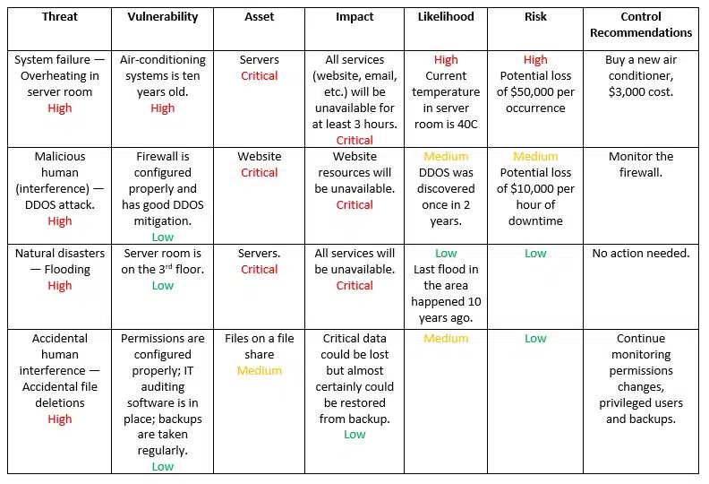

## Understanding Penetration Testing Basics

- **Purpose**:
  - Penetration testing evaluates security defenses through simulated attacks to identify vulnerabilities and enhance protection against cyber threats.

- **Testing Approach**:
  - Ethical hackers simulate real-world attacks on systems to uncover weaknesses and test the effectiveness of security measures.

- **Coverage**:
  - Assessments target network devices, email, web interfaces, wireless networks, applications, and databases to locate and exploit vulnerabilities.

- **Compliance Focus**:
  - Pen testing helps organizations meet regulatory requirements by assessing security gaps and ensuring systems align with evolving standards.

- **Benefits**:
  - Identifies weaknesses like unnecessary services, social engineering effectiveness, and malware protection status.
  - Provides insights into system security under simulated attack scenarios.

- **Ethical Protocol**:
  - Ethical hackers operate with permission, stop testing upon major findings, and recommend security enhancements based on assessment results.

Penetration testing is a critical practice for organizations to strengthen their security posture, detect vulnerabilities, and improve defenses against cyber threats.
___

## Auditing Security Mechanisms

- In an organization, a security audit is a comprehensive assessment of the safety of a company's information assets. 
- Auditing generally follows a structured plan or set of criteria, such as PCI DSS compliance. Auditing a network can be a complex undertaking. 

**Attack Surfaces**
- Today's networks have many attack surfaces or areas of exposure. 
- Attack surfaces can include 
**software,** 
**hardware,** 
**network, and** 
**the users.** 

**Compliance regulation**
- Auditing can be done voluntarily, but in most cases, it's required as part of a compliance regulation, such as HIPAA, PCI DSS, or Sarbanes-Oxley. 
- **HIPPA**:(Health Insurance Portability and Accountability Act)) to not share patient health related information
- **PCI DSS** : (Payment Card Industry Security Standards) is an information security standard used to handle credit cards from major card brands. The standard is administered by the Payment Card Industry Security Standards Council, and its use is mandated by the card brands.
- **Sarbanes-Oxley** :The Sarbanes-Oxley Act of 2002 is a law the U.S. Congress passed on July 30 of that year to help protect investors from fraudulent financial reporting by corporations.
- In addition, customers might request the results of your security audit before entering a business partnership. 

A general auditing plan involves investigating and then testing vulnerabilities. Each company or auditor has a set of guidelines as to what they want to audit and can include all aspects of the organization. 

**Software**
A software assessment might include evaluating the system software, such as the directory, logging used, and the authentication protocols used for network services, such as DNS security. 

**Application software**
Software many times includes evaluating application software, specifically web and mobile platform testing. 

**Network**
On the network, we check the devices, such as firewalls, intrusion detection, intrusion prevention systems, and logging and alert capabilities, along with configuration and authentication methods, and visible network services. We also check the users. 

**User**
Using social engineering techniques, we see if we can gain access into the building. The ethical hacker will attempt `tailgating` or `piggybacking`, and phishing attacks using email, instant messaging, and social media to get employees to click on a link to release malware or download a rootkit. Auditing is not a spot check, it's a complete evaluation of the security posture of an organization. When complete, an audit will help identify any gaps in security controls. 

In today's organizations, everyone is responsible for the security of an organization. Instead of waiting to be compelled to have an audit or, worse yet, finding you have weaknesses by being a victim of a hack, an organization should proactively go through an annual audit.

**Explain how an audit can help identify any gaps in security controls.**
> 1. **Selecting audit criteria**: Defining the standards and controls to be evaluated.
> 2. **Assessing staff training and access**: Reviewing employee knowledge and permissions for data security.
> 3. **Reviewing logs and incident responses**: Analyzing network activity logs and how incidents are handled.
> 4. **Identifying vulnerabilities**: Finding weaknesses like outdated software or weak passwords.
> 5. **Implementing protections**: Ensuring staff training, updated tools, and secure networks are in place.

## Managing Risk

- **Penetration Testing (Pen Testing)**: Conducted proactively to reduce overall risk by identifying vulnerabilities in an organization's security.
- **Risk Management**: Crucial for evaluating potential issues that could harm the business and reducing risk to safeguard tangible (e.g., computers) and intangible assets (e.g., trade secrets).
- **Risk Assessment**: Risk is calculated as threats multiplied by vulnerabilities, emphasizing the need to address both to mitigate risks effectively.
`Risk = threats x Vulnerability`
- **Threats**: Can exploit vulnerabilities to access and harm assets, ranging from human errors to natural disasters, posing risks like financial loss or business disruption.
- **Vulnerabilities**: Weaknesses in systems that threats can exploit, such as unpatched software or misconfigurations, leading to unauthorized access.
- **Risk Mitigation**: Involves prioritizing and addressing vulnerabilities to reduce overall risk, ensuring ongoing testing and remediation efforts.
- **Case Study - Rainstorm**: Demonstrates how addressing vulnerabilities (like carrying an umbrella and wearing a raincoat) reduces the risk of getting wet, highlighting the importance of managing vulnerabilities to lower overall risk levels.

[Click here Blog Related to IT Risk Assesment](https://blog.netwrix.com/2023/08/04/it-risk-assessment/)

## Risk Assesment
- **Risk Analysis**: Crucial initial step in risk reduction for organizations, involving a security risk assessment to identify and manage potential threats and vulnerabilities.
- **Steps in Security Risk Assessment**:
   1. **Asset Identification**: List and prioritize assets like software, hardware, and data to determine what needs protection.
   2. **Threat Identification**: Recognize potential threats such as natural disasters or human errors.
   3. **Vulnerability Assessment**: Identify weaknesses like configuration errors or outdated software.
   4. **Control Review**: Evaluate existing controls like firewalls and intrusion detection systems.
   5. **Likelihood and Impact Assessment**: Determine the likelihood and impact of incidents, categorizing them as high, medium, or low.
   6. **Risk Prioritization**: Analyze data to prioritize security risks, focusing on the most critical areas.
   7. **Control Recommendations**: Propose controls to mitigate identified risks effectively.
   8. **Documentation**: Document assessment results comprehensively for reference and future planning.
- **Real-Life Example**: Utilizing a security risk assessment tool tailored for the medical profession, like one designed for HIPAA compliance, to guide through the assessment process and assign a risk level based on the information provided.

**Q. Describe the steps taken during a security risk assesment.**
Let's create a scenario for a small business, a local bakery, conducting a security risk assessment:

1. **Identify and Prioritize Assets**:
   - Assets: Point of Sale (POS) system, customer database, recipe database.
   
2. **Identify Threats**:
   - Threats: Data breaches, theft of customer information, ransomware attacks.
   
3. **Identify Vulnerabilities**:
   - Vulnerabilities: Weak password policies, outdated POS software, lack of encryption.
   
4. **Analyze Existing Controls**:
   - Controls: Firewall, antivirus software, access controls to the POS system.
   
5. **Determine Likelihood of an Incident**:
   - Likelihood: Medium for data breaches, low for physical theft.
   
6. **Assess Impact of Threats**:
   - Impact: Financial loss from data breach, reputational damage from customer data theft.
   
7. **Prioritize Risks**:
   - Prioritize: Data breach risk ranked highest due to financial and reputational impact.
   
8. **Recommend Controls**:
   - Controls: Implement two-factor authentication, update POS software regularly, train staff on security best practices.
   
9. **Document Assessment Results**:
   - Document: Create a report detailing findings, risks, controls, and action plan for mitigation.

By following these steps, the bakery can enhance its security posture, protect customer data, and reduce the risk of potential security incidents.

**Example**
  **Scenario**: The local bakery, Sweet Delights, is a popular neighborhood spot known for its delicious pastries and friendly service. With an increasing number of customers using their online ordering system and loyalty program, the bakery has recognized the need to assess its security risks to protect customer data and maintain trust.

1. **Identify and Prioritize Assets**:
   - Assets: Online ordering system, customer database with contact information and purchase history, recipe database with proprietary recipes.

2. **Identify Threats**:
   - Threats: Data breaches leading to customer information exposure, ransomware attacks disrupting operations, theft of proprietary recipes.

3. **Identify Vulnerabilities**:
   - Vulnerabilities: Weak password practices, outdated software on the online platform, lack of encryption for customer data storage.

4. **Analyze Existing Controls**:
   - Controls: Firewall protecting the network, antivirus software on computers, limited access to recipe database.

5. **Determine Likelihood of an Incident**:
   - Likelihood: Medium for data breaches due to online presence, low for physical theft of recipes.

6. **Assess Impact of Threats**:
   - Impact: Financial loss from compromised customer data, reputational damage from recipe theft affecting business uniqueness.

7. **Prioritize Risks**:
   - Prioritize: Data breach risk as the highest due to potential financial and reputational impact.

8. **Recommend Controls**:
   - Controls: Implement two-factor authentication for online system access, regularly update software, encrypt customer data, conduct staff training on cybersecurity best practices.

9. **Document Assessment Results**:
   - Document: Create a detailed report outlining identified risks, recommended controls, and an action plan for mitigation, ensuring ongoing monitoring and updates to security measures.

By conducting a thorough security risk assessment and implementing the recommended controls, Sweet Delights can enhance its cybersecurity defenses, safeguard customer information, and maintain its reputation as a trusted bakery in the community.

## Recognizing the attack surface
An attack surface is like all the doors and windows an intruder could use to break into a house. Let's explore the different ways hacker can try to get into a system. The Security Analyst is like the guard protecting the system from these break-ins. They need to know about Attack Vectors and Attack Surfaces to keep the system safe.

- **Attack Vector**: It's the sneaky way an intruder might try to break in, like tricking someone into giving their password or finding a hole in the system's defenses.

- **Attack Surface**: This is like all the possible entry points an intruder could use, such as Software, Networks, and Users. Pen Testers are like security who look for these weak spots.

- **Software Attack Surface**: The biggest entry point for intruders, including things like Browsers, Web Apps, and Services. Updating software and checking for security holes helps lock these doors.

- **Network Attack Surface**: This includes servers, devices, and connections that intruders could sneak through. Closing unnecessary doors and only letting trusted people in helps secure this area.

- **User Attack Surface**: The most vulnerable spot, where any person interacting with the system could accidentally or on purpose let the intruder in. Educating users about security and training them to spot dangers helps protect this entry point.

- **Conclusion**: Every organization has its unique setup, and intruders usually go for the easiest way in. By understanding and securing all these entry points, the security team can keep the system safe from intruders.

## Chapter Quiz
A(n) _____ is a security flaw in a system a threat can exploit to gain unauthorized access to an asset.
***Vulnerability***

During a Risk Analysis exercise, we identify _____, such as natural disasters or human error
***threats***

The _____ attack surface includes exposure to servers, devices, protocols, applications, and interfaces.
***network***

Penetration Testing or ethical hacking is a _____ security assessment that tests internal and external systems by simulating attacks.
***proactive***

A(n) _____ assessment can include the directory, logging used, and authentication protocols used for network services, web, and mobile platform testing.
***software***