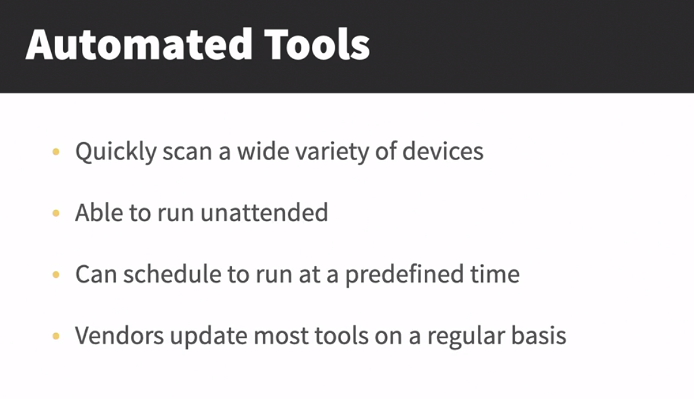
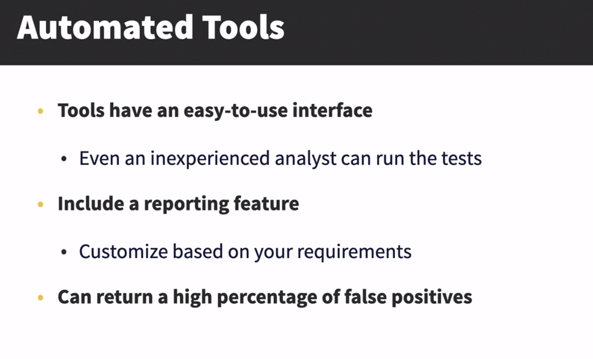
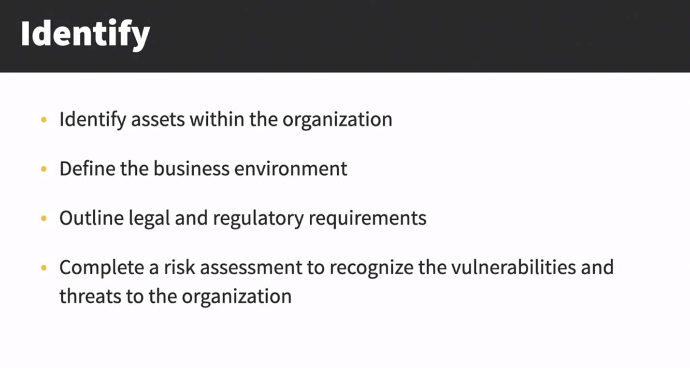
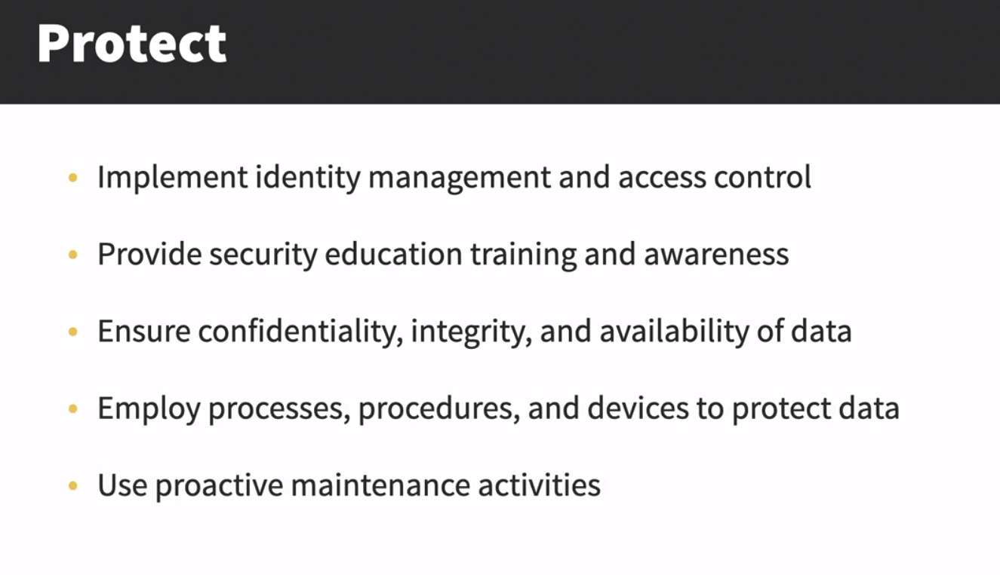
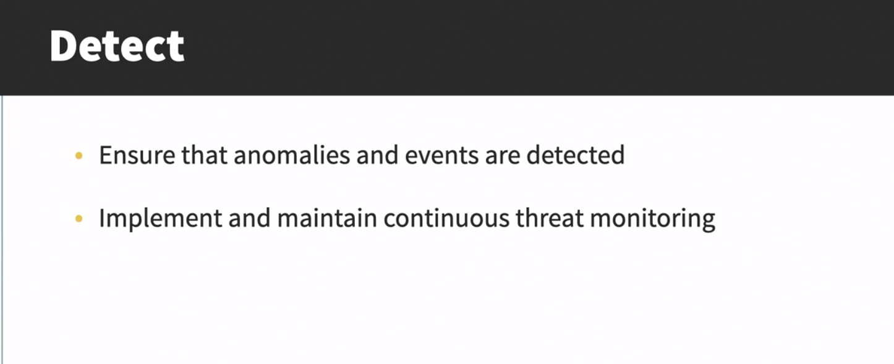
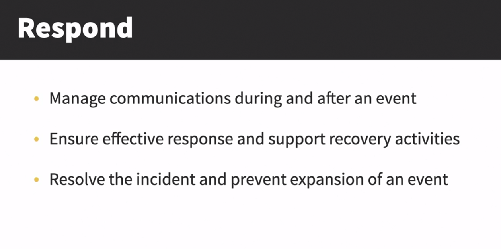
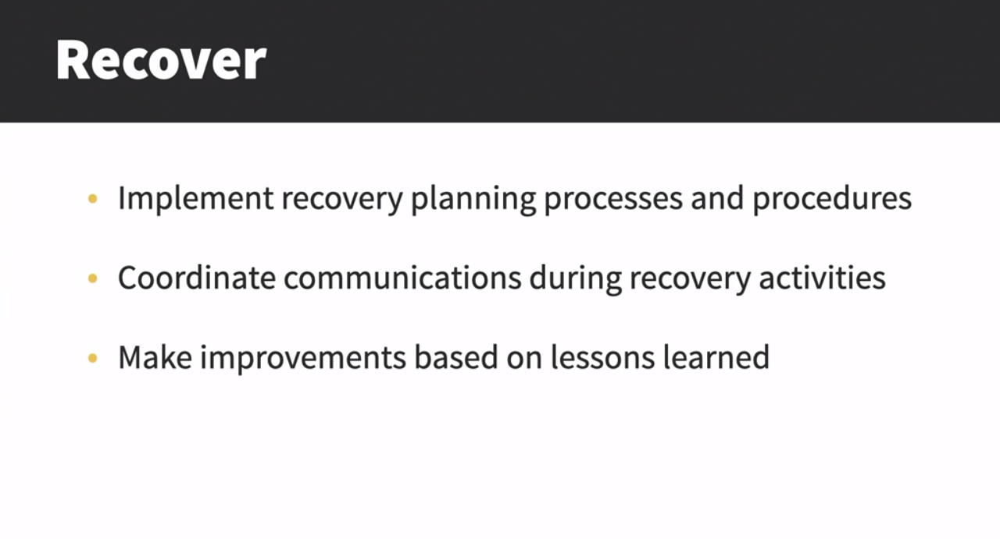

# Types of Penetration Testing
## Comparing different environment
When evaluating a system, the analyst test three approaches, unknown, known, and partially known environment testing.
### Unknown
- Advantages


- Disadvantage


### Known or Clear box testing
- Advantages


- Disadvantage


### Partially Known
- Advantages


- Disadvantage


### Which Testing Approach to Choose?
- It is determined during the kickoff meeting
- Key Consideration
    - Overall goals of the audit
    - Time allowed for the assesment
    - Amount of access to the source code

- When selecting a method, we might consider the following options. 
- For a short-term assessment with limited exposure to source code, 
    - unknown environment testing is used. 
- For an intense analysis that uncovers software vulnerabilities, 
    - we use a known environment test. 
- For a combination test that sees with the hacker see from the outside looking in, along with touching on some of the obvious vulnerabilities 
    - we use a partially known environment approach.
___
## Checking from the outside in

The attack take place in Perimter network
- Attacks (that occur in this perimter layer are more web oriented)
    - DOS
    - Malware, Cache Poisoning
- In this type of testing the tester doesn't have much information of the system
- To Begin this type of testing the tester has to start by getting username and password of non administrative account. The level of access is not enough to start attack
- Administration of the account is required to install root-kit or any other source of malicous software 
- Administration is accessed using Vulnerabilities related to Operating System or application not known by developer
- As outside attacks are more based on web. Attacks on web is possible because many web developer are not aware of such vulnerabilities existance
- **Organisation can reduce this attack by using proper practice**
    - Proper Coding Practices
    - Input Validation will ensure that only properly formed data is entering the workflow
        
    ```
    <!-Input Validation for email>
    Input type = "email"
    ```
    if user fill invalid input or sql query it will show
    " Enter a valid email address "


___
## Looking inside the organisation
- Checks for threats outside an indside an organisation
    - Unknown environment testing sees what a hacker on the outside can see
    - Known environment testing looks inside the internal structuree and design of an organisation software
        - Is a First Step in identifying internal threats
        - No need to attack the system
    - Starts with the ethical hacker armed with full knowledge of the system and key credentials
- When testing tester can use various approaches
    - Approach 1 : View as Malicous Insider
        - Provide team with same access as internal user
        - They will try to access resources that should not be accessible to malicious insider if possible
    - Approach 2 : Check Source Code
        - Anomalies, coding errors
        - Vulnerabilities, insecure design
- Once approach are checked the team will make recommendations to the dev team to mitigate the vulnerabilities
    - For Example: Threat can stay hidden iun your system for months as an advanced presistent threat
    like RAT(Remote Access Trojan)
- **Easter EGG**
    - =ran(5,10) # generate random text in words
    - about:robots # in firefox
    - do a barell roll on google

___
## Determining testing methods
### Automated Testing


### Manual Testing
- A fully run manual test would require a team of specialized experts
- Manual testing depends on the human factor that has the knowledge of the subject

### Couple Automated With Manual
1. Use Automated tool during scannning phase
2. Move to a manual assesment
    - Confirm and then expliot the assessment

### Announced Testing
- Begin by obtaining a comprehensive view of the infrastructure
    - Along with passwords, Keywards, floor plans

### Unannounced Testing
- Tests different portions of the infrastructure
    -  Only top management is aware of the testing
- Uncovers human errors, negligence and ignorance
- The most affective type is social engineering attempts
- Use carefully as it may cause a service interruption
- The more powerful option
- Simulates real world conditions
- Watch for an agile response when a threat occurs

___
## Discovering pen testing tools

• One powerful suite of tools is Kali Linux; find a premade virtual machine for either 
VMware or VirtualBox here: https://www.osboxes.org/kali-linux/
• To find a list of reconnaissance tools, visit: 
https://www.firecompass.com/blog/top-10-tools-for-reconnaissance/
• Ethical hackers use a variety of tools when testing; learn more here: 
https://www.softwaretestinghelp.com/penetration-testing-tools/
• Learn about Nmap, an open-source tool for network discovery and security auditing, 
by visiting: https://nmap.org/
• In addition to scanners, the ethical hacker will use a variety of password cracking tools; 
find a list of the 10 most popular tools here: 
https://resources.infosecinstitute.com/topic/10-popular-password-cracking-tools
___
## Challenge: Explain the NIST five framework core functions
We know the purpose of a penetration testing exercise is to strengthen an organization’s 
overall security posture. When providing recommendations on how to better secure your
organization, there is help. One of the resources is NIST. Publications in the NIST Special 
Publications (SP) 800 series were developed to address and support the security and 
privacy needs of US federal government information and information systems. They are 
freely available and can provide a ton of valuable information. Learn more here: 
https://www.nist.gov/itl/publications-0/nist-special-publication-800-series-general-information
Obtain the NIST Cybersecurity Framework, found at 
https://nvlpubs.nist.gov/nistpubs/CSWP/NIST.CSWP.04162018.pdf, which outlines the five 
functions of the cybersecurity framework. Those functions include identify, protect, detect, 
respond, and recover. 
• For this challenge, provide a brief overview of each of the five functions. The challenge 
should take you about 10 minutes
___
## Solution: Explain the NIST five framework core functions
Identify

Protect

Detect

Respond

Recover


## Chapter Quiz
- For a Pentest that sees what the hackers see from the outside looking in, along with touching on some of the obvious vulnerabilities use a _____ approach.
***Partially known environment***

- With _____ testing, the ethical hackers review the source code for anomalies, coding errors, vulnerabilities, and insecure design.
***Known environment***

- When using automatic tools be cautious of the high percentage of _____ positives.
***false***


- One of the first phases of Ethical Hacking is _____, which is all about obtaining as much information about the target as possible
***reconnaissance***


- Looking from the outside in uses _____ testing, and the ethical hackers do not have any information about the system or infrastructure.
***Unknown environment***