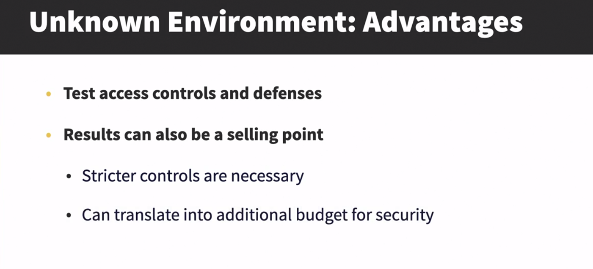
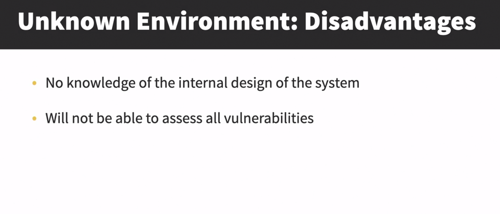
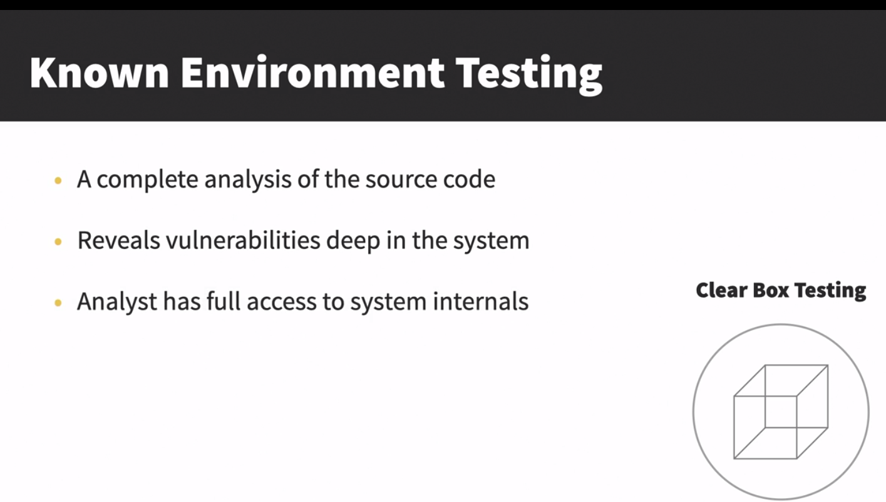
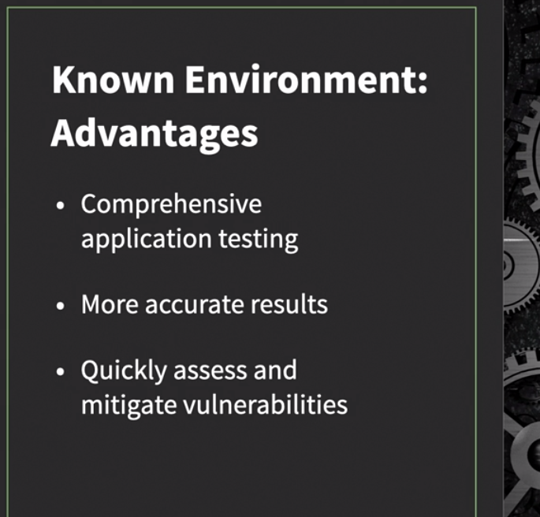
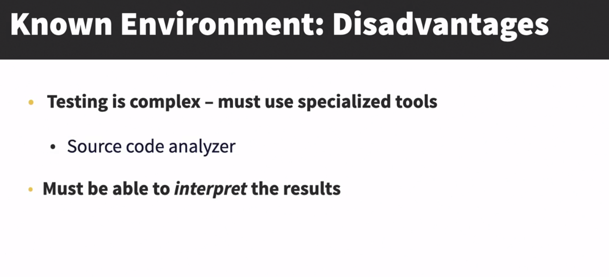
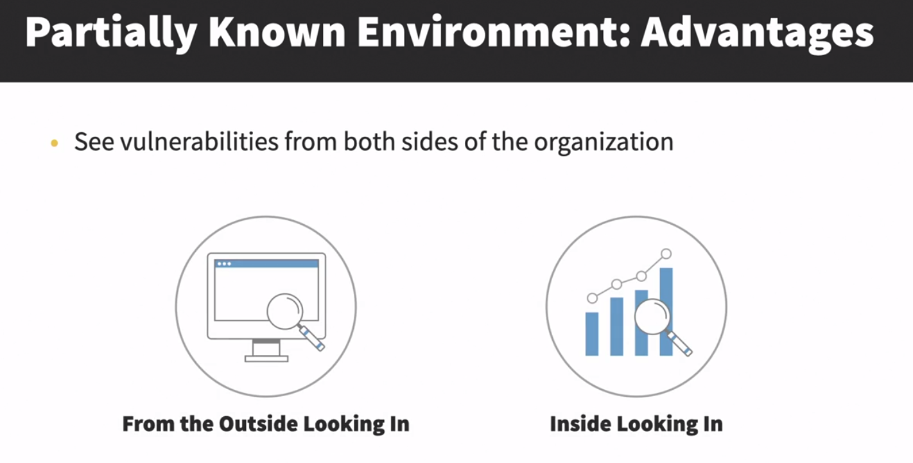
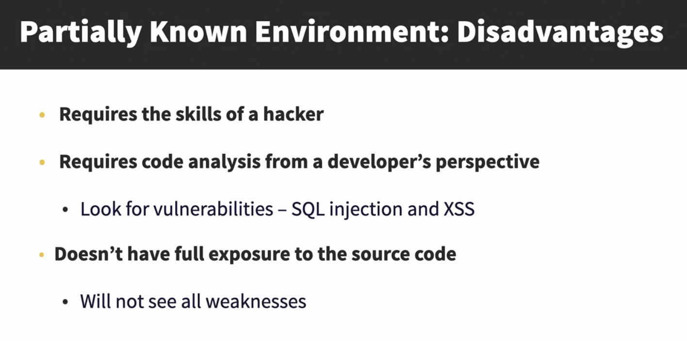
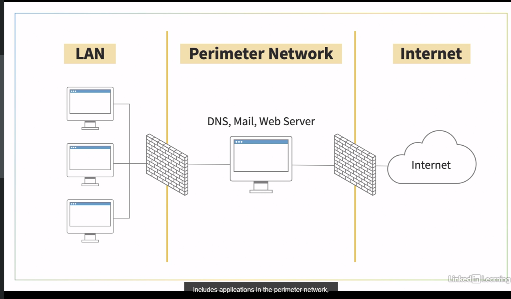
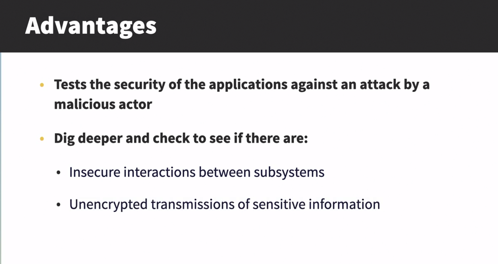

# Types of Penetration Testing
## Comparing different environment
When evaluating a system, the analyst test three approaches, unknown, known, and partially known environment testing.
### Unknown
- Advantages


- Disadvantage



### Known or Clear box testing
- Advantages



- Disadvantage



### Partially Known
- Advantages


- Disadvantage



### Which Testing Approach to Choose?
- It is determined during the kickoff meeting
- Key Consideration
    - Overall goals of the audit
    - Time allowed for the assesment
    - Amount of access to the source code

- When selecting a method, we might consider the following options. 
- For a short-term assessment with limited exposure to source code, 
    - unknown environment testing is used. 
- For an intense analysis that uncovers software vulnerabilities, 
    - we use a known environment test. 
- For a combination test that sees with the hacker see from the outside looking in, along with touching on some of the obvious vulnerabilities 
    - we use a partially known environment approach.
___
## Checking from the outside in

The attack take place in Perimter network
- Attacks (that occur in this perimter layer are more web oriented)
    - DOS
    - Malware, Cache Poisoning
- In this type of testing the tester doesn't have much information of the system
- To Begin this type of testing the tester has to start by getting username and password of non administrative account. The level of access is not enough to start attack
- Administration of the account is required to install root-kit or any other source of malicous software 
- Administration is accessed using Vulnerabilities related to Operating System or application not known by developer
- As outside attacks are more based on web. Attacks on web is possible because many web developer are not aware of such vulnerabilities existance
- **Organisation can reduce this attack by using proper practice**
    - Proper Coding Practices
    - Input Validation will ensure that only properly formed data is entering the workflow
        
    ```
    <!-Input Validation for email>
    Input type = "email"
    ```
    if user fill invalid input or sql query it will show
    " Enter a valid email address "




___
## Looking inside the organisation
___
## Determining testing methods
___
## Discovering pen testing tools
___
## Challenge: Explain the NIST five framework core functions
___
## Solution: Explain the NIST five framework core functions
___
## Chapter Quiz