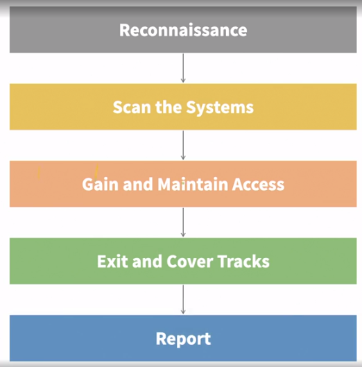
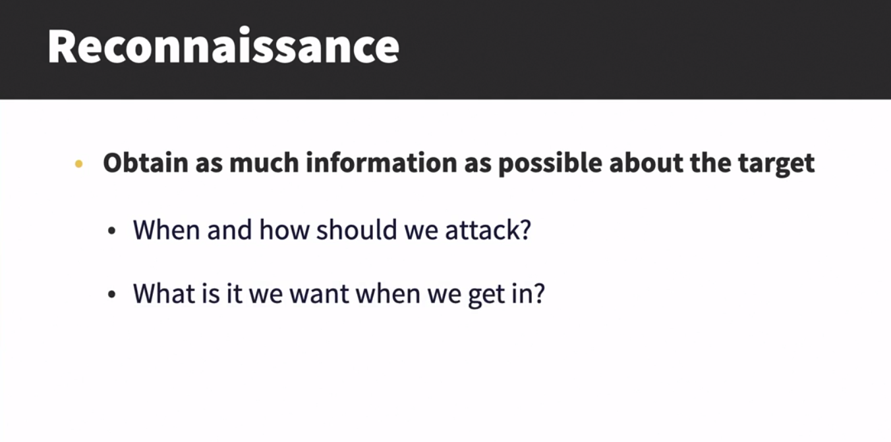
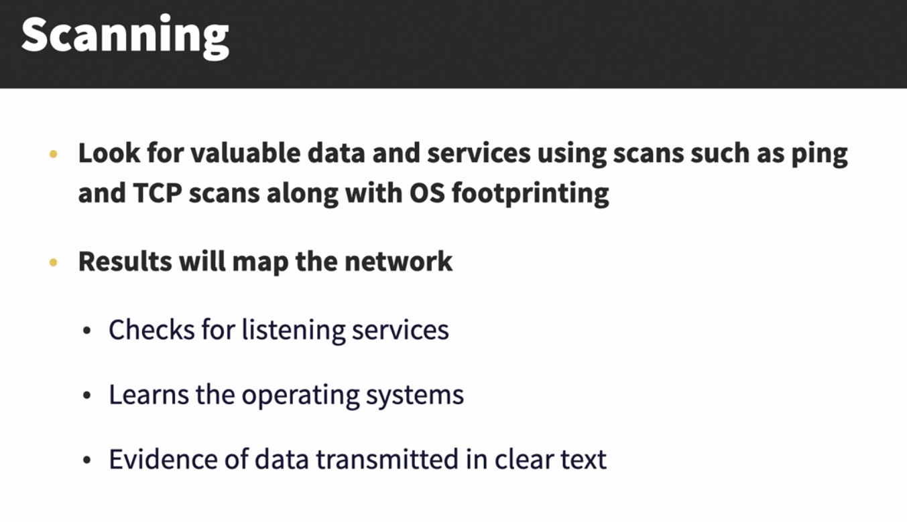
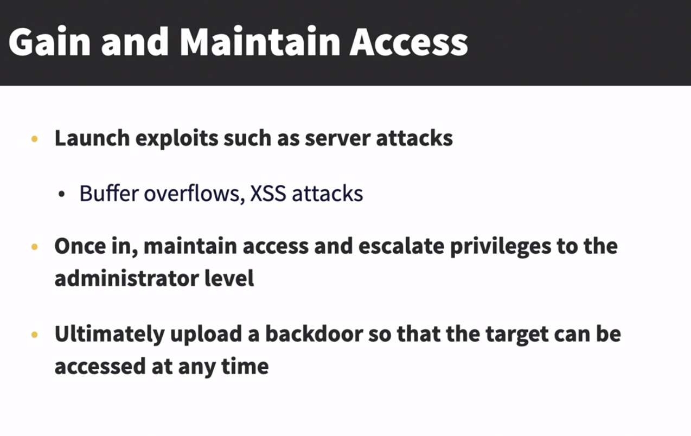
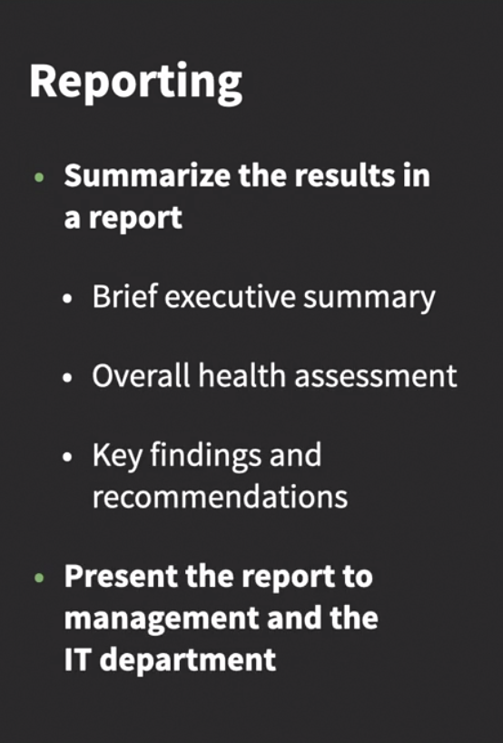
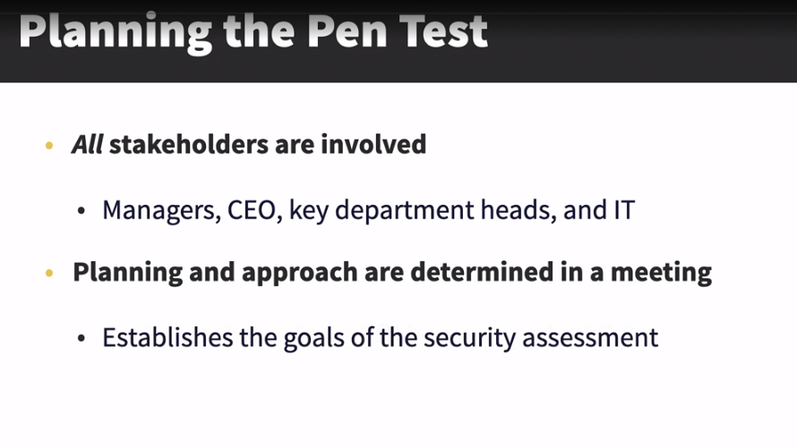
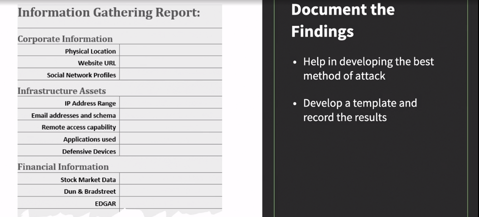
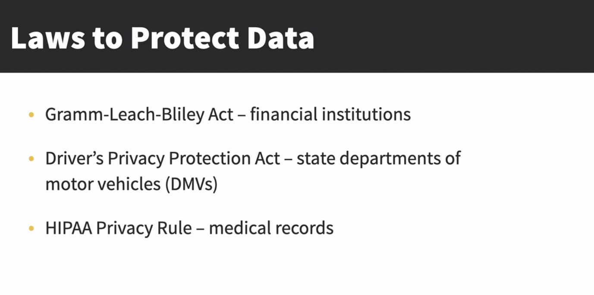
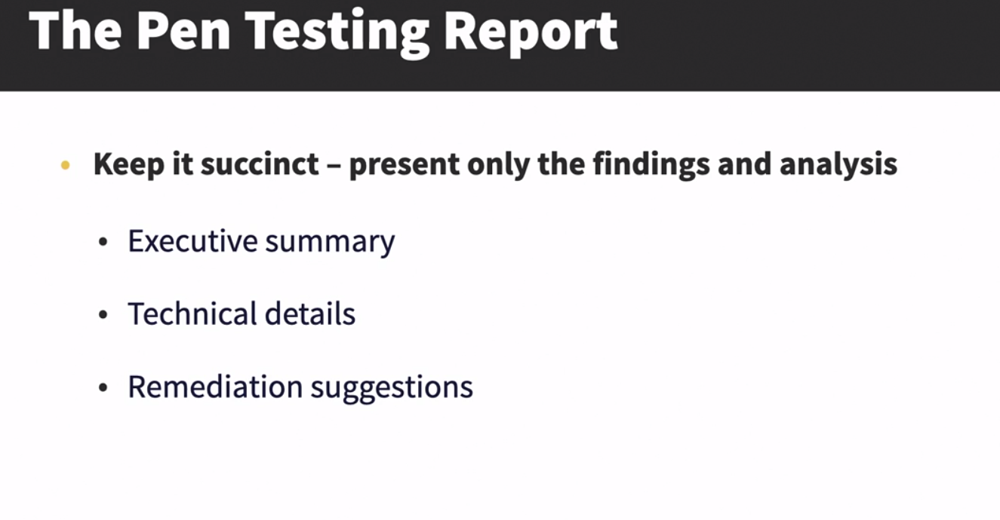
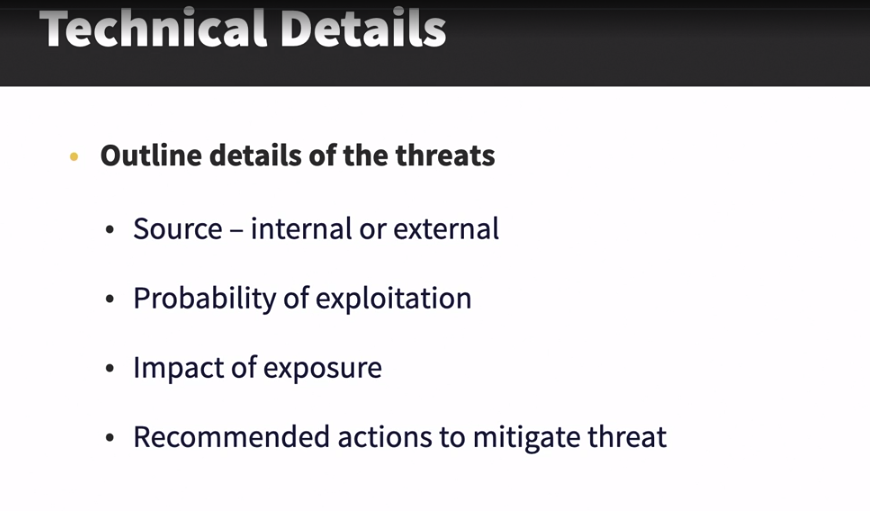

# Penetration Technique's
## Following a structure plan
- 
- 
- 
- 
- **Exit and Cover Tracks**
- 

___
## Planning the pen test

- **Organization Involvement**: When planning a penetration test, it's a decision involving the entire organization, including managers, the CEO, key department heads, and IT personnel. A kickoff meeting with all stakeholders establishes the goals of the security assessment.

- **Purpose of Penetration Testing**: The primary aim of a penetration test is to evaluate the strength of a company's security defenses against potential cyber-attacks. It is a critical exercise that may cause unease or confusion among participants, highlighting the need for a carefully selected team aligned with the organization's requirements.

- **Relevance of Repeated Testing**: While previous training like phishing exercises may have been successful, periodic testing is essential to assess ongoing vulnerabilities and employees' responses to evolving threats. By testing the effectiveness of security measures against phishing attacks, organizations can gauge their overall security resilience.

- **Team Preparation**: Before initiating a penetration testing exercise, it is crucial to ensure the team is well-trained and knowledgeable, as they often collaborate with various stakeholders. The team requires specific documentation, including policies, procedures (e.g., disaster recovery, incident response), and networking details (e.g., system topology, operating systems, applications, security devices) to navigate and analyze systems effectively. These preparatory steps are vital for a comprehensive and successful penetration testing process.
___
## Footprinting the target
**Sources of Information**: Information can be found in various places, both publicly available and through logical resources. Public sources include websites, directories, email addresses, job sites, and social media platforms. On the logical side, network mapping is used to understand the target's network architecture, locate security devices like firewalls, and identify operating systems and applications.
- Active and Passive  Reconnaissance: 
- Google hacking
- Maltego and Nmap

___
## Escalating privileges
 - Privilege escalation happens when a user gains access to more resources or functionality than they are typically allowed, often due to flaws in the application.
 - This unauthorized elevation can lead to the application performing actions with higher privileges than intended by the developer or system. 
 - There are two types of privilege escalation: vertical, where a user accesses resources granted to more privileged accounts, and horizontal, where a user accesses resources granted to similarly configured accounts.

___
## Attacking the system

___
## Delivering the results

___
## Outlining remediation strategies
Repair and Retest
___
## Chapter Quiz 

1. The planning and approach to the Penetration Test is determined in a _____ meeting with all stakeholders that establishes the goals of the security assessment.
***kickoff***

2. The _____ should be in a non-technical format
c. executive summary

3. Once the PenTest is done, the team will present a list of _____.
deficiencies

4. _____ maps the network, including the make and model of the devices, checks for listening services, learns the operating systems, and evidence of data transmitted in clear text.
Scanning

5. The term _____ stems from a military reference that deals with gathering information about the location of a target by scouting or by setting up covert observation posts.
reconnaissance

6. In _____ privilege escalation the ethical hacker will gain access to an account and then elevate the privilege to a higher level.
vertical

7. The _____ Act requires financial institutions ensure the security and confidentiality of client information and keep customer information secure.

Gramm-Leach-Bliley