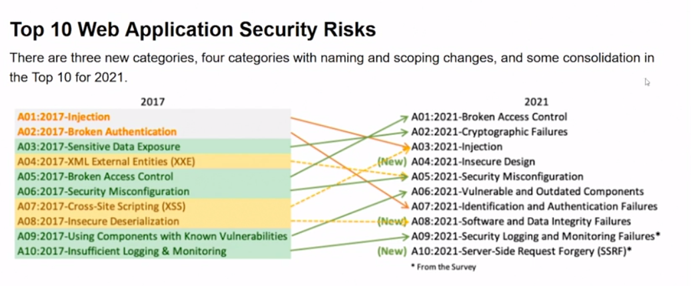

# 03 Penteration Testing blueprint
## Checking Physical Activity
- On site visit to evalute the physical controls
    - Getting in the Building
        - How high off the ground are the windows
            - Could someone get in through the windows
        - Look at the building at night?
    - Walk  around the building
        - Are there any roof openings
        - Are the fire escapes too easy to access by someone trying to get into the building?
    - In the building
        - Check that there are acccess controls in place
            - Locks, access cards, biometric devices
        - Is there a way to monitor who enteres and exits those rooms?
            - Surveillance sensors, alarms
        - Are there any guards or receptionists?
     - Employee Behavior
        - Do employees leave their systems logged in while away from system?
        - Do employee leave laptop, cell phones, or USB drives unattended?
- Begins by collecting information on the building

## Identifying wireless vulnerabilities
Benefits of Wireless Network
- Quikly add user
- Can create a different space for guest users
- Allow user to Roam freely

Wifi
- Uses unbounded media
    - A cable doesn't tether the signal
    - Radio waves can pass throgh air
    - Anyone within range can eavesdrop 
Passive Attack
- A precursor to an attack
- Captures unencrypted traffic

 Active Attack
 - Man in the middle
    - Hacker creates a fake access point 
    - Letting people connect to it instead of the real one
    - Deautheticates legitimate clients
    - Redirects them to the fake
    - Free Wifi networks are not safe
- Denial of Service attack
    - Floods network with requests so no one can send/receive data.
    - Deauthentication flood
        - floods with forged deauthentication packets
- Physical Jammer - include wireless jammer

Best Practices
- Use encryption
- User Education
    - Don't automatically connect anything that doesn't require a password on public wifi
    - Implement Access Control List (ACL)
    - Limit number of devices allowed per user
    - Keep your router firmware up to date
- Install WPA2 Enterprise
- Setup VLANs

## Testing the website
What would be the greatest impact?
- What would cause your company to be in an opening segment on CNN(news) because of a major data leak?
- Once identified, focus efforts to test that data

Application Testing
- Input validation of form information
- XSS, SQL injection, and buffer overflow
- XSS (Cross-Site Scripting) Attack: Injecting malicious scripts into web pages viewed by other users, typically through input fields. For example, an attacker might inject a script that steals session cookies from users who view their malicious input on a forum post.
- SQL Injection Attack: Injecting SQL code into a vulnerable website's input fields to manipulate the website's database, potentially gaining unauthorized access or leaking sensitive data. For example, an attacker might input a specially crafted string into a login form to bypass authentication or extract user data.
- Buffer Overflow Attack: Overwriting adjacent memory locations of a buffer to manipulate the program's behavior or crash the system, often aiming to execute arbitrary code. For example, an attacker might exploit a buffer overflow vulnerability in a software application to gain control over the system.

- Test All Application
    - Web
    - Network
    - End-user
-    

## Leaking data via email or VoIP
- Data Loss
    - Users leak data, either maliciously or accidentally
    - Malicous emails can leads to a data breach
    - A hacker can tap into an unencrypted VoIP stream and listen to the conversation
- Which is why Ethical hacker should check email and Voip communication to ensure they do not provide path for unintentional disclosure
- Email
    - Spam can contain a link to a bogus website -> Clicking anywhere on the page might release malware
    - Attackers spoof sender addresses and use social engineering to trick the victim into sending information via email
    - Overall 90% of all phishing emails contain ransomware
- Best Practice
    - If not sure don't click or simply delete(if not imp)
    - Use up-to-date antivirus
    - Report sus emails to the network admin

VoIP
- Vishing
    - Phishing using phone
        - Get user to surrender sensitive information
- ID spoffing
- Malware
    - Voip uses software
    - A hacker can place malware on a system -> Activates once Voip user establishes connection
- Eavesdropping
- Best Practices
    - Use  strong passwords for voip accounts
    - Enable two factor authentication (2
    FA)
    - Upgrade firmware
    - Use VLANS to seperate voice from data
    - Use Authentication and encryption
    - Use antivirus and antispam filters/preventions.

## Safeguarding cloud services
- Cloud computing is more vulnerable due to its nature
- Security measures:
    - Firewalls
    - Virtual Private Networks (VPNs)
    - Encryption
    - Access Control Policies : Limit to only authorized individuals
    - Regular Audits : issue alert when there is a policy violation
    - Configuration management : maintain a secure baseline
    - Least privilege principle : give users
- PCI DSS (Payment Card Industry Data Security Standards)
## Assessing the mobile infrastructure
- Mobile devices are increasingly becoming part of the workplace, but they pose unique security challenges
- Many mobile devices lack built in anti malware protection
    - Can be easily bypassed as malware can infect the users device
    - Can spread through network when the device connects
- Mobile Threats
    - Dependeny Vuln: Some apps are secure on surface but may be dependent on other application that are vuln
    - Access Control : User may fail to implement any access control
    - MFA can be more secure option for defending a mobile device, the company might not be using this option
• Learn how to secure your mobile device by visiting: 
https://www.networksolutions.com/blog/resources/ebooks/how-to-secure-mobiledevices-from-common-vulnerabilities
## Hacking the human
- Social Engineering
- Manipulation of people into providing confidential or sensitive information
- Testing techniques:
    - Email Spoof and phish attack on employee/vendor to check if they are vulnerable to those 

- Before Testing
    - Clear wriiten instruction before any testing
        - Approved by stakeholder and HR
    - Include activities you want to test
        - Dumpster diving
        - Walking out of the building with the equipment
- Create real world attack but dont harm (stay in law)

Best Practices
- Use Fictional Emp
    - Impersonate someone in the organisation only when you have written permission
- Only observe items in plain sight
    - Dont open desk drawer but you can check if they can be easily opened or not
- While performing spoofing attack make sure not to use expliot the aim is to fool the person not to cause damage

Avoid a Social Engineering Attack
- Have emp wear identification all the time
- Lock down privacy settings on social media acounts
## Chapter Quiz
Weak and stolen _____ represents over 70% of the network intrusions, which a hacker can obtain by keylogging, malware, or phishing attacks.
***credentials***

A(n) _____ attack is using phone to get the user into surrendering sensitive information.
***vishing***

Cloud computing has become popular and can result in cloud and virtualization _____ where instances of VM and containers become unmanageable
***sprawl*** 
*Sprawl refers to the uncontrolled growth of instances of virtual machines (VMs) and containers in cloud and virtualization environments.Sprawl can result in security vulnerabilities, increased costs, and decreased efficiency. In a sprawl situation, VMs and containers may be created and forgotten, taking up valuable resources and increasing the attack surface for malicious actors.*

During a physical security assessment, you'll want to check that there are _____ in place for buildings and rooms, such as locks or biometric devices.
***access controls***

To prevent malicious actors from sniffing clear-text transmissions to identify user credentials and sensitive information, you should use _____.
***encryption***

_____ an iPhone removes the protective seal and any OS specific restrictions to give users greater control over the device.
***jailbreaking***

Over time, industry has strengthened our defenses and as a result, malicious actors look to penetrate a softer target, the people in an organization, by using a _____ attack.
***social engineering***