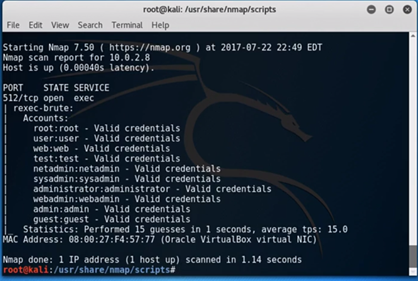

# Pentesting Tools
## Scan network with Nmap
- Nmap is checking the most common services to see if they're open on the host. It does this by starting to open a connection to the service, and then closing it down before the connection is complete. This is called a TCP SYN ping, and it works by sending an empty TCP packet with the SYN flag set and waiting for the host to respond with the standard SYN-ACK response. While a normal connection would be completed by sending back an ACK, Nmap instead cancels the connection before it completes.
- nmap -sn
    - Subnet
    - nmap -sn 74.125.130.104
        ```
        @D-Sensei ➜ /workspaces/Prac (main) $ nmap -sn  www.google.com
        Starting Nmap 7.80 ( https://nmap.org ) at 2024-04-03 06:50 UTC
        Nmap scan report for www.google.com (142.250.70.100)
        Host is up (0.0033s latency).
        Other addresses for www.google.com (not scanned): 2404:6800:4009:81f::2004
        rDNS record for 142.250.70.100: pnbomb-ac-in-f4.1e100.net
        ```
- nmap -PS
    - Port scan capital
    - nmap -PS 74.125.130.104
        ```Output
        @D-Sensei ➜ /workspaces/Prac (main) $ nmap -PS  74.125.130.104
        Starting Nmap 7.80 ( https://nmap.org ) at 2024-04-03 06:59 UTC
        Nmap scan report for sb-in-f104.1e100.net (74.125.130.104)
        Host is up (0.057s latency).
        Not shown: 998 filtered ports
        PORT    STATE SERVICE
        80/tcp  open  http
        443/tcp open  https

        Nmap done: 1 IP address (1 host up) scanned in 5.68 seconds

      ```

- nmap -sU 74.125.130.104
    - UDP port scan
    - 
    ```
    root ➜ /workspaces/Prac (main) $ nmap -sU 74.125.130.104
    Starting Nmap 7.80 ( https://nmap.org ) at 2024-04-03 07:05 UTC
    Nmap scan report for sb-in-f104.1e100.net (74.125.130.104)
    Host is up (0.058s latency).
    All 1000 scanned ports on sb-in-f104.1e100.net (74.125.130.104) are open|filtered

    Nmap done: 1 IP address (1 host up) scanned in 6.74 seconds
    ```
- nmap -sU -P0 74.125.130.104
    - -P0 Skip the ping check
    - takes time

- nmap -sV -p22 74.125.130.104
    - sV check version 
    - p22 port number 22
    ```
    root ➜ /workspaces/Prac (main) $ nmap -sV -p22 74.125.130.104
    Starting Nmap 7.80 ( https://nmap.org ) at 2024-04-03 07:11 UTC
    Nmap scan report for sb-in-f104.1e100.net (74.125.130.104)
    Host is up (0.055s latency).

    PORT   STATE    SERVICE VERSION
    22/tcp filtered ssh

    Service detection performed. Please report any incorrect results at https://nmap.org/submit/ .
    Nmap done: 1 IP address (1 host up) scanned in 1.34 seconds
    ```

- nmap -sSUV -p U:53,111,137,T:21-25,80,139,8080 10.0.2.8
    - sSUV show both TCP and UDP
    - -p port 
    - U: means udp ports
    - T: means TCP ports
    ```Output
    nmap -sSUV -p U:53,111,137,T:21-25,80,139,8080 74.125.130.104
    Starting Nmap 7.80 ( https://nmap.org ) at 2024-04-03 07:23 UTC
    Nmap scan report for sb-in-f104.1e100.net (74.125.130.104)
    Host is up (0.055s latency).

    PORT     STATE         SERVICE     VERSION
    21/tcp   filtered      ftp
    22/tcp   filtered      ssh
    23/tcp   filtered      telnet
    24/tcp   filtered      priv-mail
    25/tcp   filtered      smtp
    80/tcp   open          http        gws
    139/tcp  filtered      netbios-ssn
    8080/tcp filtered      http-proxy
    53/udp   open|filtered domain
    111/udp  open|filtered rpcbind
    137/udp  open|filtered netbios-ns
    1 service unrecognized despite returning data. If you know the service/version, please submit the following fingerprint at https://nmap.org/cgi-bin/submit.cgi?new-service :
    SF-Port80-TCP:V=7.80%I=7%D=4/3%Time=660D03DE%P=x86_64-pc-linux-gnu%r(GetRe
    SF:quest,15E0,"HTTP/1\.0\x20200\x20OK\r\nDate:\x20Wed,\x2003\x20Apr\x20202
    SF:4\x2007:23:11\x20GMT\r\nExpires:\x20-1\r\nCache-Control:\x20private,\x2
    SF:0max-age=0\r\nContent-Type:\x20text/html;\x20charset=ISO-8859-1\r\nCont
    SF:ent-Security-Policy-Report-Only:\x20object-src\x20'none';base-uri\x20's
    SF:elf';script-src\x20'nonce-f6AA2XRFhetOEOI33iXVFA'\x20'strict-dynamic'\x
    SF:20'report-sample'\x20'unsafe-eval'\x20'unsafe-inline'\x20https:\x20http
    SF::;report-uri\x20https://csp\.withgoogle\.com/csp/gws/other-hp\r\nP3P:\x
    SF:20CP=\"This\x20is\x20not\x20a\x20P3P\x20policy!\x20See\x20g\.co/p3phelp
    SF:\x20for\x20more\x20info\.\"\r\nServer:\x20gws\r\nX-XSS-Protection:\x200
    SF:\r\nX-Frame-Options:\x20SAMEORIGIN\r\nSet-Cookie:\x201P_JAR=2024-04-03-
    SF:07;\x20expires=Fri,\x2003-May-2024\x2007:23:11\x20GMT;\x20path=/;\x20do
    SF:main=\.google\.com;\x20Secure\r\nSet-Cookie:\x20AEC=Ae3NU9NeRMGLQExPhIB
    SF:WWzrDR2BpmfVwLbBL3A8aCKSZi-BkoQ1w12eE3g;\x20expires=Mon,\x2030-Sep-2024
    SF:\x2007:23:11\x20GMT;\x20path=/;\x20domain=\.google\.com;\x20Secure;\x20
    SF:HttpOnly;\x20SameSite=lax\r\nSet-Cookie:\x20NID=512=d3jkz_N4aqP_p95A949
    SF:uiLo2iKeel6d-VQ1apB4oCp_1RUVo1rlYNGrWa5kVFnoWQoJZyjuQ")%r(HTTPOptions,7
    SF:0F,"HTTP/1\.0\x20405\x20Method\x20Not\x20Allowed\r\nAllow:\x20GET,\x20H
    SF:EAD\r\nDate:\x20Wed,\x2003\x20Apr\x202024\x2007:23:11\x20GMT\r\nContent
    SF:-Type:\x20text/html;\x20charset=UTF-8\r\nServer:\x20gws\r\nContent-Leng
    SF:th:\x201592\r\nX-XSS-Protection:\x200\r\nX-Frame-Options:\x20SAMEORIGIN
    SF:\r\n\r\n<!DOCTYPE\x20html>\n<html\x20lang=en>\n\x20\x20<meta\x20charset
    SF:=utf-8>\n\x20\x20<meta\x20name=viewport\x20content=\"initial-scale=1,\x
    SF:20minimum-scale=1,\x20width=device-width\">\n\x20\x20<title>Error\x2040
    SF:5\x20\(Method\x20Not\x20Allowed\)!!1</title>\n\x20\x20<style>\n\x20\x20
    SF:\x20\x20\*{margin:0;padding:0}html,code{font:15px/22px\x20arial,sans-se
    SF:rif}html{background:#fff;color:#222;padding:15px}body{margin:7%\x20auto
    SF:\x200;max-width:390px;min-height:180px;padding:30px\x200\x2015px}\*\x20
    SF:>\x20body{background:url\(//www\.google\.com/images/errors/robot\.png\)
    SF:\x20100%\x205px\x20no-repeat;padding-right:205px}p{margin:11px\x200\x20
    SF:22px;overflow:hidden}ins{color:#777;text-decoration:none}a\x20img{borde
    SF:r:0}@media\x20screen\x20and\x20\(max-width:772px\){body{background:none
    SF:;margin-top:0;max-width:none;padding-right:0}}#l");

    Service detection performed. Please report any incorrect results at https://nmap.org/submit/ .
    Nmap done: 1 IP address (1 host up) scanned in 105.19 seconds
    ```

- nmap -O -PS 74.125.130.104
    - O operating System
    - Linux Example
    ```opt
    root ➜ /workspaces/Prac (main) $ nmap -O -PS 74.125.130.104
    Starting Nmap 7.80 ( https://nmap.org ) at 2024-04-03 07:28 UTC
    Nmap scan report for sb-in-f104.1e100.net (74.125.130.104)
    Host is up (0.055s latency).
    Not shown: 998 filtered ports
    PORT    STATE SERVICE
    80/tcp  open  http
    443/tcp open  https
    Warning: OSScan results may be unreliable because we could not find at least 1 open and 1 closed port
    Device type: general purpose
    Running (JUST GUESSING): FreeBSD 8.X (87%), OpenBSD 4.X (87%)
    OS CPE: cpe:/o:freebsd:freebsd:8.2 cpe:/o:openbsd:openbsd:4.0
    Aggressive OS guesses: FreeBSD 8.2-RELEASE (87%), OpenBSD 4.0 (87%)
    No exact OS matches for host (test conditions non-ideal).

    OS detection performed. Please report any incorrect results at https://nmap.org/submit/ .
    Nmap done: 1 IP address (1 host up) scanned in 10.03 seconds
    ```

- root ➜ /usr/share/nmap/scripts $ ls
    - To Check payload related nmap
    - We can see these in its scripts directory. These provide many advanced capabilities. Let's run one. We'll use the rexec brute force test to extract credentials via port 512. We can do this by using the --script argument. Here we see a list of valid credentials for the Metasploitable server.
    ```
    root ➜ /usr/share/nmap/scripts $ nmap 10.0.2.8 -Pn -p512 --script=rexec-brute
    Starting Nmap 7.80 ( https://nmap.org ) at 2024-04-03 07:41 UTC
    Nmap scan report for 10.0.2.8
    Host is up.

    PORT    STATE    SERVICE
    512/tcp filtered exec

    Nmap done: 1 IP address (1 host up) scanned in 2.23 seconds
    ```
    

## A netcat refresher
## Capture packets with tcpdump
## Work with netstat, nbtstat and arp
## Script with Powershell
## Extend Powershell with Nishang
## Chapter Quiz