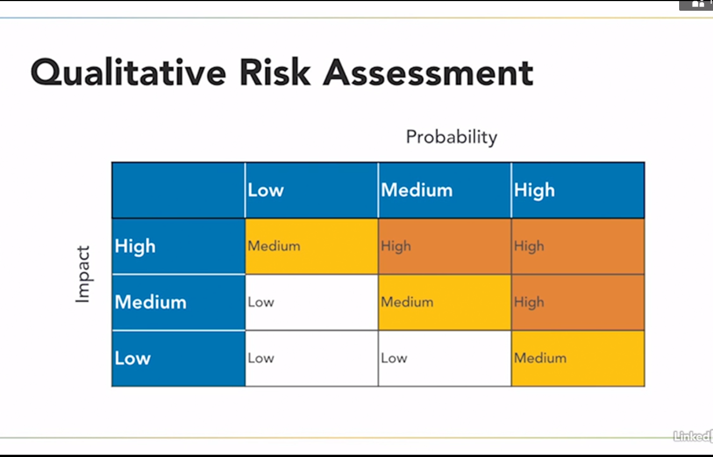

# Risk Management
## Understanding Risk
- Two types Risk
  - `Internal` arise within organisation e.g fraud
    - You can often address internal risk by adding internal controls
    - In accounting, adding two person control to the issuance of checks might reduce the risk of fraud
  - `External` arise from outside of organisation
    - E.g: Ransomware attack
- `Multiparty` risk affect more than one organisation
  - For Example, Software as a service provider is compromised, that a multiparty risk because that compromise a risk to all of the customers of the service provider
- Legacy System pose: older OS risk
- Intellectual property theft : risk to info based organisation
- Software license compilance issue risk fines and legal action
____
## Risk Assessment
- Risk Assesments identifies and triages risks based on liklihood of their occurance and their expected impact on the information
- Common Language
  - `Threats` are external forces that jeopardize security
    - Can be natural (huricane, flood) or manmade (hacking or terrorism)
    - `Threat vector` are methods used by attackers. This maybe hackertoolkit, social engineering or even physical intrusion
  - `Vulnerabilites` are weaknesses in your security controls
    - Compromise CIA of the system
    - These might include missing patches, promiscous firewall rules or other security misconfiguration
  - `Risk` are the combination of threat and Vulnerability. Risks occur when your environment contains both a vulnerability and a corresponding threat that might exploit that vulnerability. 
    - For example, if you haven't updated your antivirus signatures recently and hackers release a new virus upon the internet, you then face a risk. You're vulnerable because you're missing a security control. And there is a threat, the new virus. 
    - There is no risk of either the threat or vulnerability factor is missing
- We rank risks by `likelihood` and `impact`
    - `likelihood` is the probability that risk will occur
    - `Impact` is the amount of damage a risk will cause
- `**Qualitative Risk**` Assesment uses subjective ratings to evaluate risk of likelihood and impact

- `**Quantitative Risk**` Assesment uses numeric ratings to evaluate risk of likelihood and impact

## Risk Treatment
## Selecting Security Controls
## Configuration Management
## Chapter Quiz
